<h3><code>kuldeep@github ~ $ whoami</code></h3>

# 🧑🏼‍💻 Kuldeep Sisodiya

**Full Stack Developer**

 

  

<h3><code>kuldeep@github ~ $ ./streak.sh</code></h3>

  

<h3><code>kuldeep@github ~ $ ./contributions.sh</code></h3>

  

<h3><code>kuldeep@github ~ $ ./tech-stack.sh</code></h3>

  

<h3><code>kuldeep@github ~ $ ./quote.sh</code></h3>

  

<h3><code>kuldeep@github ~ $ ./contact.sh</code></h3>

